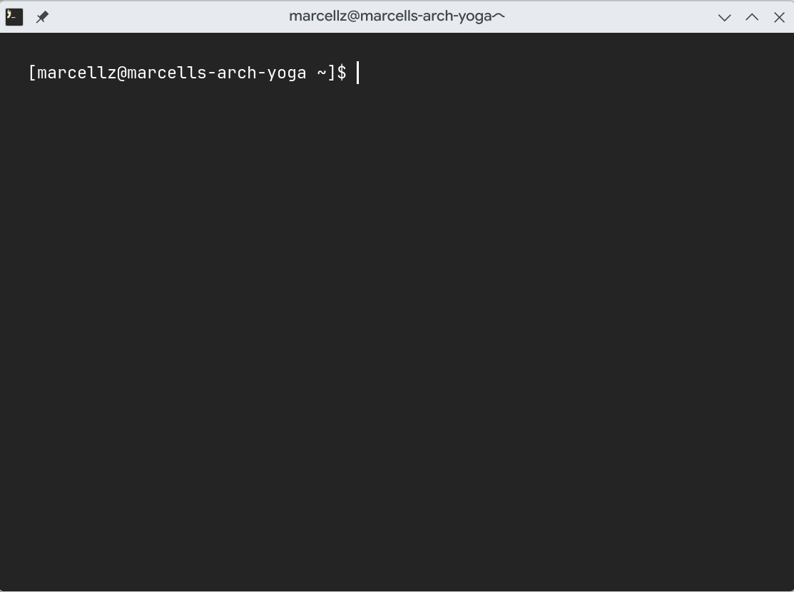

# Terminalen

Detta kapitel är en kort intro för vad terminalen är och vad den används för. Som tur är behöver ni inte använda den särskilt mycket för att vi har moderna utvecklingsmiljöer som {abbr}`abstraherar (att förenkla för enklare hantering)` bort den. Däremot är det nyttigt att ha en väldigt övergripande koll på vad de abstraktionerna faktiskt håller på med i bakgrunden. Alltså: vad händer när du tycker på Play-knappen i VSCode?

Terminalen är kort och gott sättet att köra program på din dator som inte har ett grafisk fönster. Detta är till exempel Pythontolken och Pythons REPL från det tidigare kapitlet. Terminalen gör det möjligt att interagera med din dator utan några grafiska fönster och knappar, vilket kan vara snabbare i vissa fall.

## Vart finns terminalen?

På alla operativsystem, har man i regel en app som heter Terminal som du kan öppna. På Linux har den ofta mer tjusiga namn som `foot`, `Alacritty`, `GhosTTY`, `Konsole`, m.m. Era datorer från lägret kör på Alacritty. Vilken app ni än har så starta den, så får ni upp en kommandotolk:



## Vad kan man göra i terminalen?

Det tråkiga svaret är "allt". Men för våra ändamål så kan man köra Pythonkod. Men i allmänhet, kommandon körs i en terminal genom att deras namn skrivs ut följt av deras argument sedan trycker man på enter.

```console
> kommando arg1 arg2 ...
```

Symbolen `>` innebär början på där du kan mata in kommandon. Jag använder ett `>` eftersom varje terminal har olika prefix till inmatningen. Min i bilden ovan har ju `[marcellz@marcells-arch-yoga ~]$` som prefix.

```{warning} **OBS!**
Se till att **inte** inkludera vare sig `>` eller något som kommer före i exempel jag ger. Kommandoinmantninger sker *efter* `>` så endast det som är efter kommer att kopieras. Om det inte finns ett `>` kan du kopiera hela raden.
```

## Hur kör terminalen dina kommandon?

I terminalen finns en s.k. shell. För Linux är det oftast Bash, för MacOS är det ofta zsh och för windows är det PowerShell {u}`eller` Windows Command Prompt (CMD). Har du egen dator som kör MacOS eller Linux kommer du kunna följa allt i denna bok, har du en Windowsdator så är detta inte garanterat. Bästa resultat får du med PowerShell, men eftersom jag antar en UNIX-shell kommer allt inte nödvändigtvis att funka.

## Att köra Python i terminalen

Du kör ibland din Pythonkod från terminalen i stället för VSCode. Detta gör man med kommandot `python`. För att kolla att ditt python funkar, skriv `python -V` för att skriva ut versionen av Python du har.

```console
> python -V
Python 3.14.2
```

Notera att du kan få en annan version än mig!

```{hint} Om kommandot inte funkar
:class: dropdown
Om kommandot `python` inte funkar kan det vara så att ditt system saknar den kommandoalias som krävs för att det skall funka. Testa i stället `python3`, det ska alltid funka.

```

För att öppna en REPL, skriv `python` utan argument.

```console
> python
Python 3.14.2 (main, Jan  2 2026, 14:27:39) [GCC 15.2.1 20251112] on linux
Type "help", "copyright", "credits" or "license" for more information.
>>>
```

Efter `>>>` kan du skriva rader Pythonkod som körs en och en. För att komma ut skriver du `quit()` sen enter.

För att köra en Pythonfil, skriv `python` följt av filens namn.

```console
> python kod.py
*dina prints kommer här*
```

## Användbara kommandon

Först gäller det att förstå att terminalen alltid är öppen i en viss mapp på din dator. Majoriteten av terminaler öppnar sig själva i din hemmapp, eller `~`, som motsvrar `/home/<username>`. På Windows är detta `C:\Users\<username>`. Om du vill vara någon annanstans, för att köra en kodfil som inte ligger där till exempel, kan du använda kommandot `cd` (Change Directory). Ett exempel:

```console
~ > cd ~/code
~/code >
```

De flesta prefix inkluderar filsökvägen till din Current Working Directory (cwd), så därmed är det inkluderat även här för exemplets skull. Det är också din cwd som du byter när du använder `cd`.

För att se alla filer i din cwd kan du använda `ls`:

```console
~/code > ls
dice-parser  freq-to-notes  intuitive  pico  rfs-python-bok  zero.py
~/code > ls
```

Detta är ett exempel från min dator, där jag bland annat kodar denna bok i mappen `~/code/rfs-python-bok`.

Du kan göra en ny mapp med `mkdir` följt av mappens namn.

```console
~ > ls
mapp1 mapp2 fil1.py
~ > mkdir mapp3
~ > ls
mapp1 mapp2 mapp3 fil1.py
```

Du skapar alltid mappen i din cwd.

Du kan göra en ny vanlig fil med `touch` följt av det önskade filnamnet. Vi testar att göra en fil som heter `kod.py` i den mappen vi precis skapade, utgående från förra exemplet.

```console
~ > cd mapp3
~/mapp3 > ls

~/mapp3 > touch kod.py
~/mapp3 > ls
kod.py
```

Vi kan konstatera att mappen är tom först, men `kod.py` existerar efter vi skapar den.

Det sista kommandot jag nämner är Visual Studio Code:s, vår utvecklingsmiljös, kommando. Du kan använda den för att snabbt redigera en fil från terminalen. Du skriver `code` följt av filen du vill öppna. Vidare från tidigare exempel:

```console
~/mapp3 > code kod.py
*ett nytt fönster med VSCode öppnas där du kan rediera filen*
```

Om du i stället skriver `.` som filnamn öppnar hela den nuvarande cwd:n. Att skriva `.` refererar till den mappen du är i nu.

```console
~/mapp3 > code .
*hela mapp3 öppnas i ett VSCode fönster*
```
