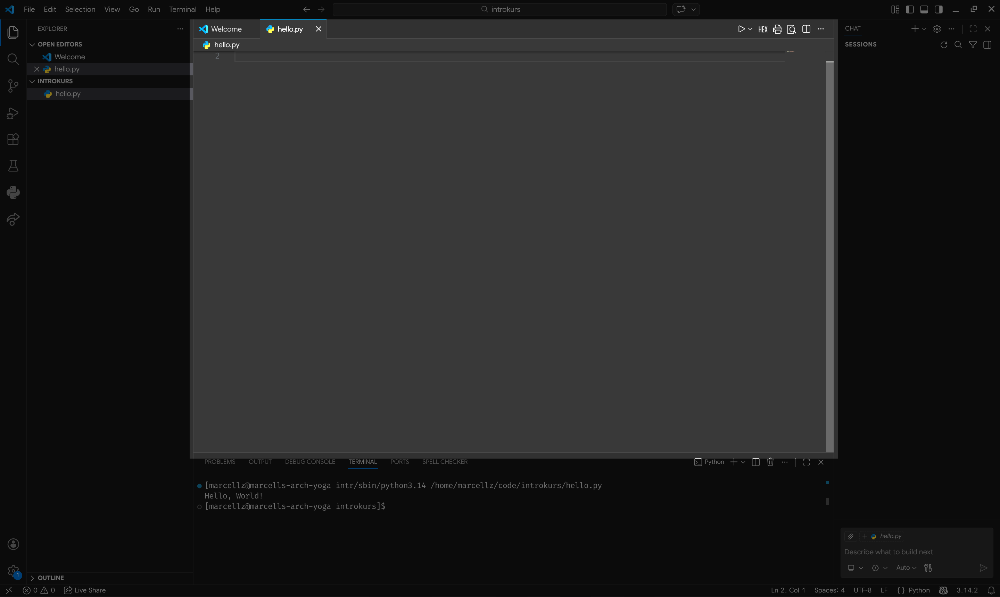
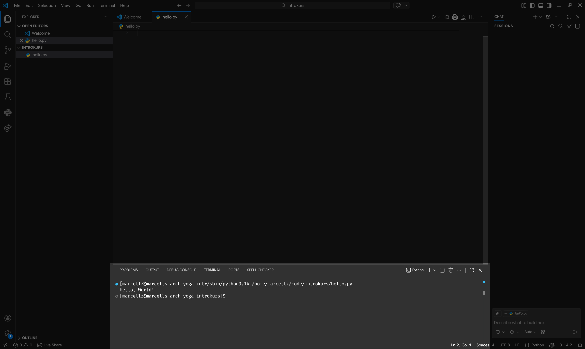
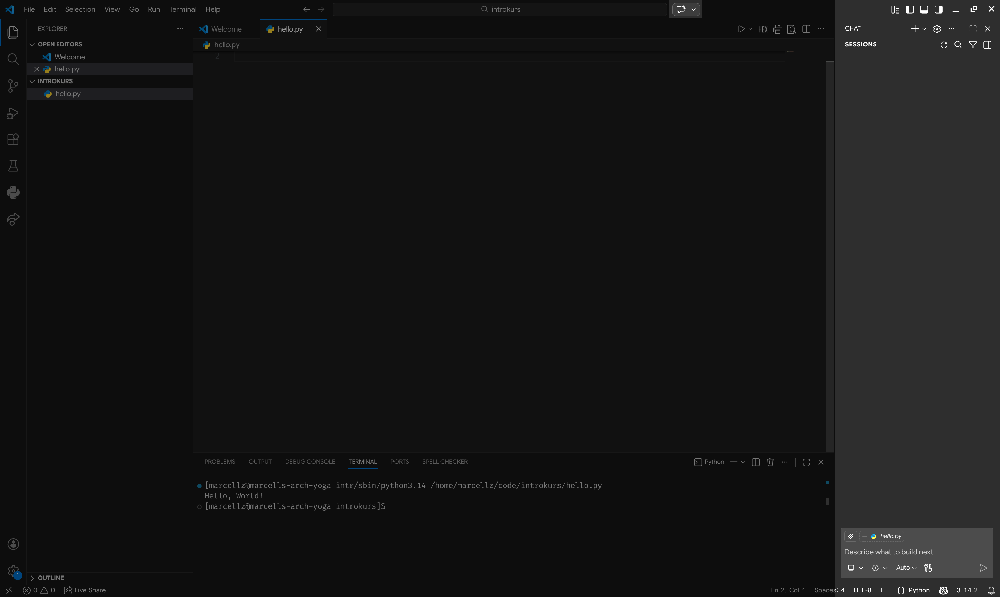
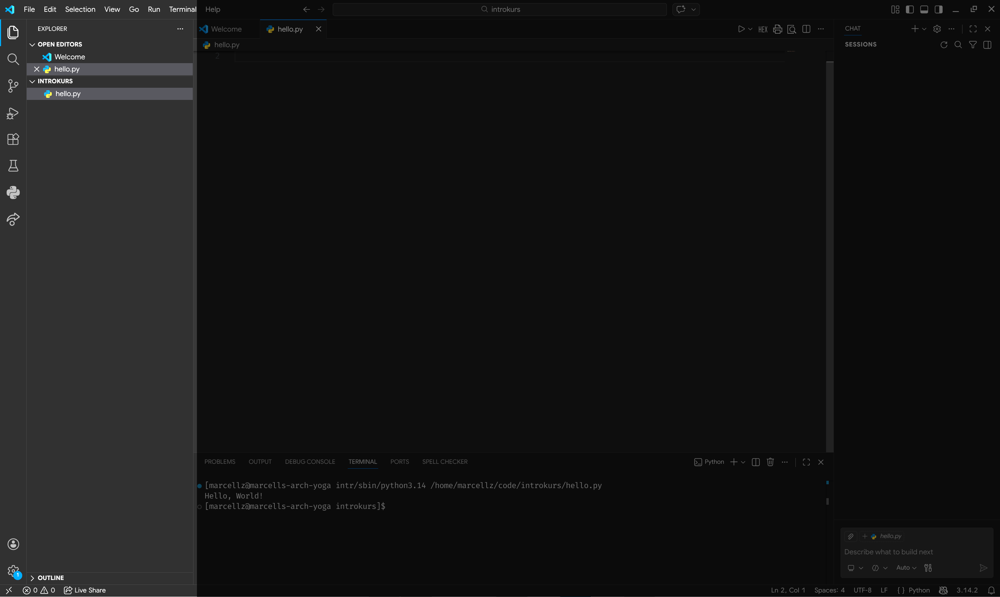

# Hello, World!

Grattis! Nu vet du grunder i vad programmering är, och har bekantat dig lite med terminalen! Nu är det faktiskt dags att prata om Python specifikt.

Sedan urminnes tider har man verifierat att sin programmeringsmiljö fungerar genom att skriva ut orden "Hello, World!", så det är det vi kommer att jobba upp till i detta kapitel.

## Först med en REPL

Det allra lättaste sättet att testa kort kod är via en REPL som tidigare nämnt i [tidigare kapitel](#repl-intro).

Vi använder metodiken där, och får då som innan

```console
> python
Python 3.14.2 (main, Jan  2 2026, 14:27:39) [GCC 15.2.1 20251112] on linux
Type "help", "copyright", "credits" or "license" for more information.
>>> print("Hello, World!")
Hello, World!
>>> quit()
>
```

Testa gärna att göra detta själv i din egen terminal!

## Nu med en fil och en utvecklingsmiljö

Först, behöver du öppna och bekanta dig med VSCode. Vår utvecklingsmiljö för RFS. Det är typ det mest populära idag, och det är riktigt smidigt att använda. VSCode och alla tillbehör du behöver kommer förinstallerat på era datorer från lägret.

```{note} Om du har egen dator
:class: dropdown
Som ni blivit informerade föredrar vi användning av skolans datorer under programmeringsmomenten, och det är endast för de vi har tid att ge utförligt tekniskt stöd. Däremot om du har en egen dator och är bekväm med att använda den, hittar du det du behöver på [code.visualstudio.com](https://code.visualstudio.com). Du behöver även ladda ned en extension som heter [Python](https://marketplace.visualstudio.com/items?itemName=ms-python.python) samt [CircuitPython v2](https://marketplace.visualstudio.com/items?itemName=wmerkens.vscode-circuitpython-v2) för att kunna hänga med.

Du behöver också en fungerande version av Python ≥3.10, dock helst senaste 3.14. Det kan du skaffa dig på [python.org](https://www.python.org/downloads).
```

När du startar upp VSCode kommer det att se ut ungefär såhär:


I VSCode, precis som i terminalen, har du i regel en mapp öppen som du arbetar i. Detta kallas ditt *Workspace* eller din *Current Working Directory* (cwd), dessa termer används utbytbart.

För att öppna ett workspace, trycker ni på knappen "Open Folder" och väljer en lämplig mapp. En föreslagen struktur för era kodfiler under lägret:

```console
~
└── code
    ├── labb1
    │   ├── fil1.py
    │   ├── fil2.py
    │   └── plots.py
    ├── labb2
    │   ├── data.py
    │   └── fil1.py
    └── etc...
```

I exemplet är `~` er hemmapp som beskrivet i förra kapitlet, och ni skulle öppna varje `labbN` mapp i VSCode när ni jobbar på den labben. Det är oviktigt vilket struktur ni väljer, bara ni hittar i den.

Nu fortsätter vi genom att skapa en mapp som heter `introkurs` någonstans lämpligt och öppnar den i VSCode.


Därefter skapar vi en fil som heter `hello.py` och sedan skriver koden

```{code} python
:filename: hello.py
print("Hello, World!")
```


Det sista steget nu, är att köra filen.


Grattis, nu har din kod hälsat på världen!

## Hur använder man VSCode

Nu har ni fått ett smakprov på hur VSCode funkar, men jag ska gå igenom lite mer detaljerat hur varje del av interfacet funkar.

### Editorn



Här skriver ni all kod. Den funkar som en webbläsare med tabs. Upp till höger hittar ni play-knappen som kör er kod i terminalen längst ned.

### Terminalen



Detta är en helt vanlig terminal, fast i VSCode. Det är här all kod kommer att köras. Notera att den körde er kod precis som jag sade att ni skulle göra manuellt i det tidigare kapitlet. Den stora skillnaden är att VSCode använder s.k. *absoluta filsökvägar* medan jag hade visat *relativa filsökvägar*. En relativ filsökväg utgår ifrån din cwd, medan en absolut filsökväg börjar alltid vid din *root*, vilket har filsökväg `"/"` på UNIX-system (Linux och MacOS) och `"C:\"` på Windows.

```{seealso} Exempel på filsökvägar
Säg att din cwd är `/home/bertil/` och du vill komma åt filen `kod.py` som ligger där. Den absolut sökvägen är då `/home/bertil/kod.py`. Eftersom du redan är i `/home/bertil` vill du som användare inte behöva skriva ut allt. Då kan du i stället skriva `./kod.py`. `"."` står för din cwd eftersom du redan är där. Detta innebär att `. = /home/bertil` i {u}`detta fall`. I många fall kan du också bara skriva `kod.py` om du vill komma åt en fil som ligger i samma mapp som cwd.
```

VSCode använder sig även av en absolut sökväg för din python, vilket ofta är `/usr/bin/python`. Mer specifikt används `/usr/bin/python3.14` eftersom detta är den mest garanterade filen att köra. Sedan lämnas din fil till `python` som argument, vilket innebär att den skall köras. Filen ligger ju i min hemmapp, under mappen `code/introkurs`. Eftersom vårt Workspace, eller cwd, är `home/marcellz/code/introkurs` hade vi rent tekniskt kunnat skriva `./hello.py`, men VSCode skriver ut hela för att vara på säkra sidan. Du hade också kunnat skriva `~/code/introkurs/hello.py` där hemmappen använder förkortningen.

### AI-chatten



VSCode kommer med en inbyggd AI-chatt. Den kör GitHub Copilot, dvs. GPT-5.2 (för det mesta). Chattfönstret kan använda era filer från ert workspace för att svara på era frågor. Detta är ett väldigt kraftfullt verktyg, som ni kan få stor nytta av så länge det används ansvarsfullt. För bästa resultat se till att AI:n är inställd på "Ask"-läge och följ riktlinjerna nedan.

Ett annat tips är att stänga av autocompletions från AI:n om de råkar vara på. Det gör ni längst ned till höger, på Copilotsymbolen strax höger om texten Python i nedersta raden på er VSCode.

```{caution} Angående GitHub Copilot och andra LLM:er
VSCode, likt andra utvecklingsmiljöer idag, är ganska centrerad kring användandet av AI (mer specifik {abbr}`LLM (Large Language Model)`:er) för att skriva sin kod. Ofta kommer en ny installation av VSCode med ett AI fönster redan öppnat till höger.

**På RFS avråder vi bestämt från att använda AI för att skriva din kod åt dig!** Det kommer däremot inte råda något direkt förbud mot användningen av AI, dels för att det är omöjligt för handledarna att avgöra och för att AI är ett jättekraftfullt verktyg ni bör använda er av även under RFS så länge ni gör det ansvarsfullt.

Det må låta motsägelsefullt, men när vi säger att AI:n inte skall "skriva din kod åt dig" betyder det inte att ni inte får fråga AI om er kod och be om hjälp för att förstå vart ni har gått fel. LLM:er är superduktiga på att ge utförliga beskrivningar av kod och hur man kan göra saker bättre. De är även riktigt duktiga på att hitta vanliga fel. Utnyttja det!

#### AI-riktlinjer för programmering
- **NI KAN med fördel** ställa frågor som "varför funka inte denna kod?" för att felsöka.
- **NI KAN med fördel** be AI:n hjälpa er med syntaxen av språket, t.ex. med en fråga som "hur skriver jag en loop som itererar över elementen i en lista i python?"
***
- **NI SKA ALLTID** ställa fråga "varför?" när ni får ett svar av AI. Tänk igenom, nu när ni fått svaret, varför det funkar så att ni lär er något av det.
***
- **NI BÖR INTE** be AI:n skriva hela lösningar som ni sedan tar och inför utan att ifrågasätta. Ni kommer inte lära er så.
- **NI BÖR INTE** ta AI:ns svar som garanterad sanning. Den kan hallucinera, ha fel och föreslå mycket ineffektiva lösningar. Fråga era handledare om tips i första hand, och AI:n i andra hand.

Det är ert lärande som ni påverkar negativt med dåliga AI-vanor. Ni kommer inte lära er om ni låter en dator göra allt tänkande åt er. Däremot är AI ett verktyg ni bör ha i er arsenal för att lösa problem.
```

### Filväljaren



Längst till vänster har ni era filer. Högst upp är alla öppna filer. Raden under är namnet på er workspace, "introkurs" i detta fall. Under den har ni alla filer.
